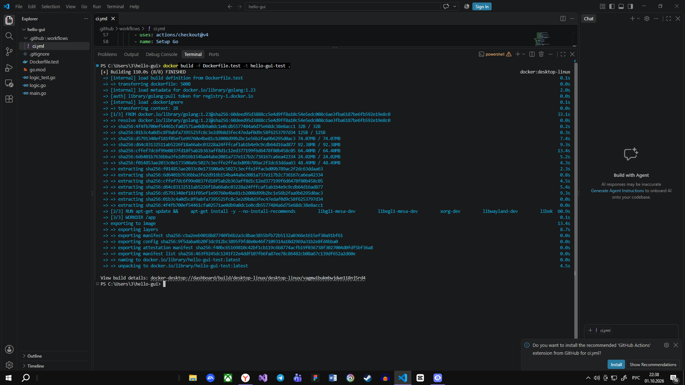
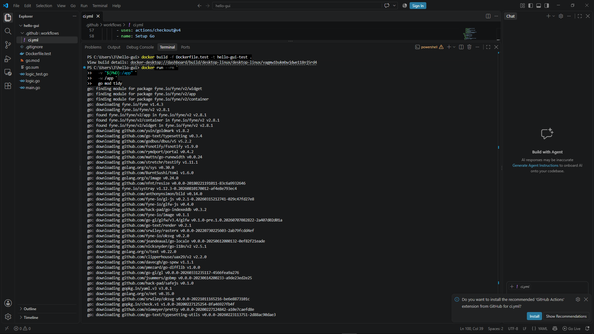
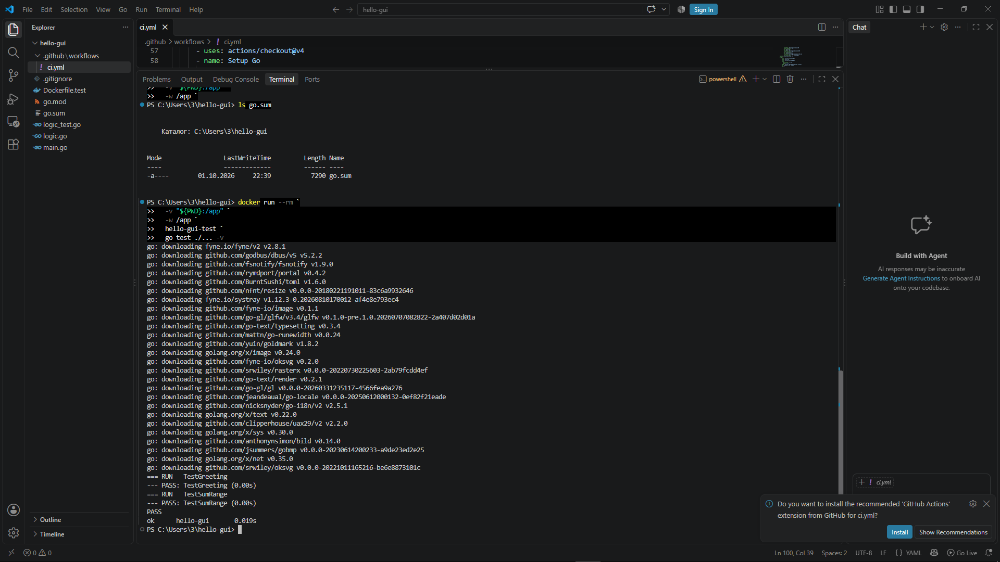
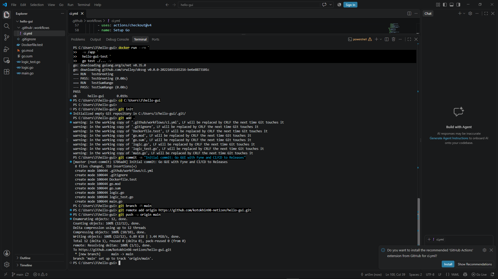
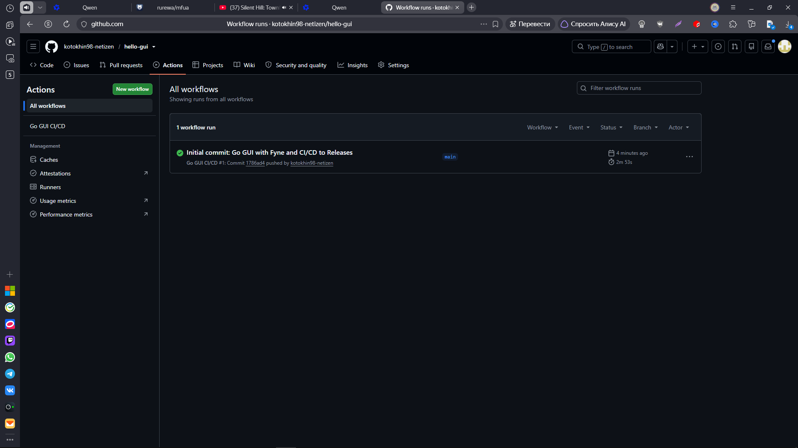
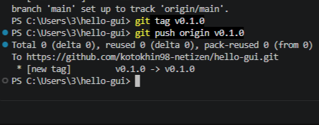
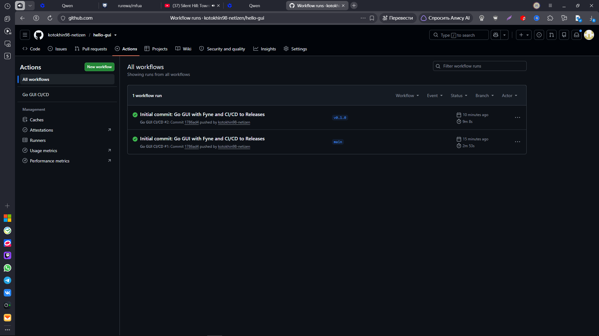
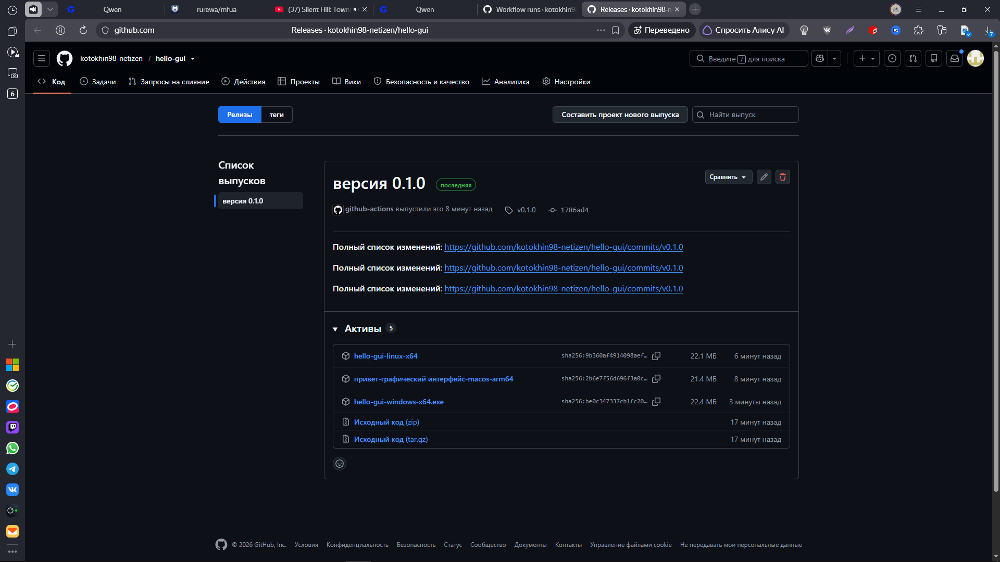

Вот README в том же стиле, что и предыдущие:

```markdown
# Hello Go GUI CI/CD Pipeline

Пример GUI-приложения на **Go** с использованием библиотеки **Fyne**, демонстрирующий настройку **пайплайна CI/CD** через GitHub Actions и публикацию кроссплатформенных **бинарников** в GitHub Releases.

## 🚀 О проекте

Этот проект демонстрирует создание нативных GUI-приложений на Go:
- **Fyne** — кроссплатформенная GUI-библиотека на чистом Go
- **CGO** — компиляция C-библиотек (GLFW, OpenGL, X11, Wayland)
- **Матричная сборка:** Сборка под 3 платформы (Linux, macOS, Windows) с нативными компиляторами
- **Автоматизация:** При создании тега `v*` запускается сборка под все платформы

> ⚠️ **Важно:** В отличие от Go CLI, **GUI-приложения с CGO не поддерживают cross-compilation**. Для каждой ОС нужен **свой runner** с нативным компилятором.

## 📂 Структура проекта

```text
hello-gui/
├── .github/workflows/
│   └── ci.yml              # Конфигурация CI (GitHub Actions)
├── Dockerfile.test         # Образ с GUI-зависимостями для Linux
├── go.mod                  # Go модуль
├── go.sum                  # Контрольные суммы зависимостей
├── logic.go                # Бизнес-логика
├── logic_test.go           # Юнит-тесты
├── main.go                 # Точка входа (GUI на Fyne)
└── .gitignore
```

## 🛠 Локальный запуск

### Вариант 1: Локально (через Docker)
Не требует установки Go и GUI-библиотек на хост:

```bash
# Сборка тестового образа с GUI-зависимостями
docker build -f Dockerfile.test -t hello-gui-test .

# Запуск тестов
docker run --rm \
  -v "${PWD}:/app" \
  -w /app \
  hello-gui-test \
  go test ./... -v

# Сборка бинарника (Linux)
docker run --rm \
  -e CGO_ENABLED=1 \
  -v "${PWD}:/app" \
  -w /app \
  hello-gui-test \
  go build -ldflags='-s -w -X main.version=v0.1.0' -o hello-gui-linux-x64 .
```

**Ожидаемый результат тестов:**
```text
=== RUN   TestGreeting
--- PASS: TestGreeting (0.00s)
=== RUN   TestSumRange
--- PASS: TestSumRange (0.00s)
PASS
ok      hello-gui       0.019s
```






### Вариант 2: Скачивание готового бинарника
Не требует установки Go или Docker. Просто скачайте файл из раздела [Releases](https://github.com/kotokhin98-netizen/hello-gui/releases).

**Windows (PowerShell):**
```powershell
Invoke-WebRequest -Uri "https://github.com/kotokhin98-netizen/hello-gui/releases/download/v0.1.0/hello-gui-windows-x64.exe" -OutFile "hello-gui.exe"
.\hello-gui.exe
```

**Linux / macOS:**
```bash
# Linux
curl -LO https://github.com/kotokhin98-netizen/hello-gui/releases/download/v0.1.0/hello-gui-linux-x64
chmod +x hello-gui-linux-x64
./hello-gui-linux-x64

# macOS
curl -LO https://github.com/kotokhin98-netizen/hello-gui/releases/download/v0.1.0/hello-gui-macos-arm64
chmod +x hello-gui-macos-arm64
./hello-gui-macos-arm64
```

## ️ CI Pipeline (GitHub Actions)

При каждом push в ветку `main` или тег `v*` автоматически выполняется:

| Шаг | Инструмент | Назначение |
|-----|-----------|------------|
| Format check | `gofmt -l` | Проверка форматирования кода |
| Lint | `go vet` | Статический анализ |
| Tests | `go test -v` | Юнит-тесты |
| Build (smoke) | `go build` | Проверка сборки |
| Matrix Build | CGO + GLFW | Сборка под 3 ОС параллельно |
| Release | `softprops/action-gh-release` | Публикация бинарников в Releases |

### Теги версий
- `v0.1.0`, `v0.2.0` — семантическое версионирование
- Версия внедряется через `-ldflags "-X main.version=${{ github.ref_name }}"`
- В коде переменная `version = "dev"` перезаписывается при сборке

## 📦 Публикация в GitHub Releases

Бинарники автоматически публикуются в **GitHub Releases** при push тега `v*`.

**URL релиза:**
```
https://github.com/kotokhin98-netizen/hello-gui/releases
```

**Доступные платформы:**
- `hello-gui-linux-x64` (~25-30 MB)
- `hello-gui-macos-arm64` (~25-30 MB)
- `hello-gui-windows-x64.exe` (~25-30 MB)

> 💡 Релиз создается **только** при push тега (например, `git tag v0.1.0 && git push origin v0.1.0`). Push в ветку `main` запускает только тесты.

## 🔧 Технологии

- **Go 1.23** — язык программирования
- **Fyne v2** — кроссплатформенная GUI-библиотека
- **GLFW** — библиотека для создания окон (компилируется из C через CGO)
- **CGO** — интерфейс Go с C-кодом
- **GitHub Actions** — CI/CD pipeline с матричными сборками
- **GitHub Releases** — публикация бинарников
- **Docker** — локальная сборка с GUI-зависимостями
- **Semantic Versioning** — управление версиями через Git-теги

---









Создано [kotokhin98-netizen](https://github.com/kotokhin98-netizen)
```

